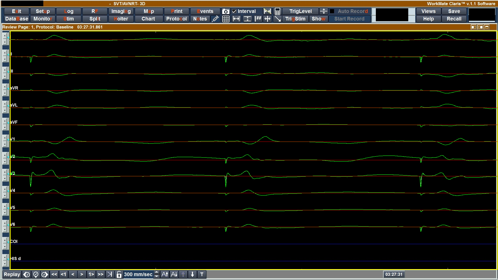
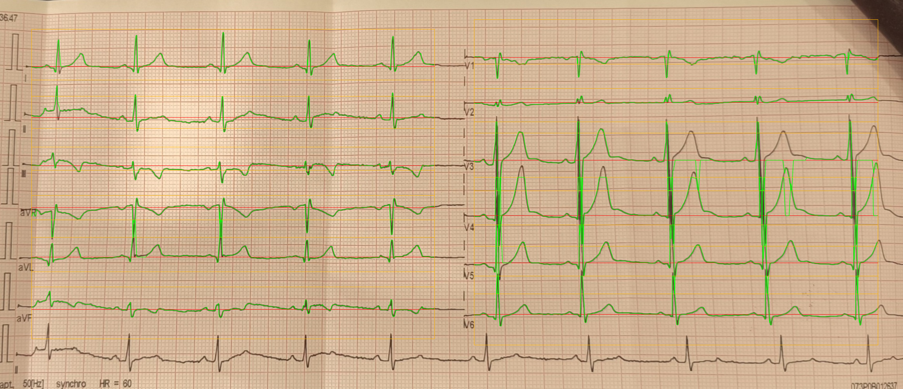

# ECG Signal Extractor

Python/OpenCV project for extracting digital ECG signals from ECG images.

The program processes ECG screenshots and scanned/photographed ECG printouts, reconstructs 12-lead ECG waveforms, saves them as CSV files, and generates debug visualizations for checking the extraction quality.

## Features

* Extraction of 12 standard ECG leads:

  * I, II, III
  * aVR, aVL, aVF
  * V1, V2, V3, V4, V5, V6
* Two processing modes:

  * `screen` — for ECG screenshots
  * `scan` — for scanned or photographed ECG printouts
* CSV export with one sample per millisecond
* Automatic baseline estimation
* Signal mask generation
* Debug overlays showing detected traces and baselines
* Basic heart rate estimation from detected R-peaks

## Project structure

```text
.
├── input/                      # example screen ECG images
├── input_scan/                 # example scanned ECG images
├── output_screens/             # CSV and debug results for screen mode
│   └── debug/
├── output_scans/               # CSV and debug results for scan mode
│   └── debug/
├── extract_ecg_clean.py        # processing pipeline for screenshots
├── extract_ecg_scan_clean.py   # processing pipeline for scans/photos
├── main.py                     # command-line entry point
└── requirements.txt
```

## Installation

Clone the repository:

```bash
git clone https://github.com/YOUR_USERNAME/YOUR_REPOSITORY_NAME.git
cd YOUR_REPOSITORY_NAME
```

Create and activate a virtual environment:

```bash
python -m venv .venv
```

On Linux/macOS:

```bash
source .venv/bin/activate
```

On Windows:

```bash
.venv\Scripts\activate
```

Install dependencies:

```bash
pip install -r requirements.txt
```

## Usage

The program is launched through `main.py`.

### Screen mode

Use this mode for ECG screenshots.

```bash
python main.py --input_dir input --output_dir output_screens --mode screen --debug
```

Example output:

```text
P5_1.JPG: BPM=90.3 (lead V2)
saved: output_screens/P5_1.csv
```

### Scan mode

Use this mode for scanned or photographed ECG printouts.

```bash
python main.py --input_dir input_scan --output_dir output_scans --mode scan --debug
```

Example output:

```text
scan_example_original.jpg: grid rectification skipped, original image kept
scan_example_original.jpg: BPM=65.3 (lead V4)
saved: output_scans/scan_example_original.csv
```

## Input format

Supported image formats:

```text
.jpg
.JPG
.jpeg
.JPEG
.png
.PNG
```

Input images should contain visible ECG traces. The quality of the result depends on image resolution, contrast, grid visibility, and how clearly the ECG signal can be separated from the background.

## Output format

For every processed image, the program creates a CSV file.

Example CSV columns:

```text
time_ms,I,II,III,aVR,aVL,aVF,V1,V2,V3,V4,V5,V6
```

Each row represents one time sample.

* `time_ms` — time in milliseconds
* lead columns — extracted ECG signal values after baseline subtraction

The exported amplitudes are pixel-based signal values, not medically calibrated voltage values.

## Debug output

When the `--debug` flag is used, additional images are saved in the `debug` folder.

For screen mode, debug files include:

```text
*.baselines.png
*.mask.png
*.overlay.png
```

For scan mode, debug files include:

```text
*.rectified.jpg
*.signal_mask.png
*.overlay.png
```

The overlay images show the reconstructed ECG traces on top of the original or rectified input image.

## Examples

### Screen ECG extraction



### Scan ECG extraction



## How it works

### Screen mode

The screenshot processing pipeline:

1. Loads the input image.
2. Detects the ECG plotting area.
3. Builds a signal mask using color and brightness thresholds.
4. Removes vertical grid artifacts and text-like components.
5. Detects lead baselines.
6. Tracks ECG traces around each baseline.
7. Interpolates missing points.
8. Exports the extracted signals to CSV.
9. Optionally saves debug masks and overlays.

### Scan mode

The scan processing pipeline:

1. Loads the scanned or photographed ECG image.
2. Detects and checks ECG grid alignment.
3. Applies rectification if needed.
4. Enhances the ECG trace and separates it from the grid/background.
5. Splits the ECG layout into lead regions.
6. Extracts each lead signal.
7. Estimates baselines and reconstructs waveforms.
8. Exports the result to CSV.
9. Optionally saves rectified images, signal masks, and overlays.

## Heart rate estimation

The program estimates BPM by detecting R-peaks in the extracted signal.
The lead with the most reliable peak pattern is selected automatically.

The BPM value is printed to the console, for example:

```text
P5_1.JPG: BPM=90.3 (lead V2)
```

## Dependencies

Main dependencies:

* NumPy
* OpenCV
* pandas
* matplotlib

They are listed in `requirements.txt`.

## Limitations

This project is intended for signal extraction and educational/research use.

Known limitations:

* The output amplitude is not calibrated to millivolts.
* Extraction quality depends strongly on image quality.
* Very noisy, blurry, rotated, cropped, or low-contrast images may produce inaccurate results.
* The BPM estimation is basic and should not be treated as a medical measurement.
* The program is not a diagnostic medical tool.

## License

No license has been specified yet.
Add a license before using or distributing this project publicly.
